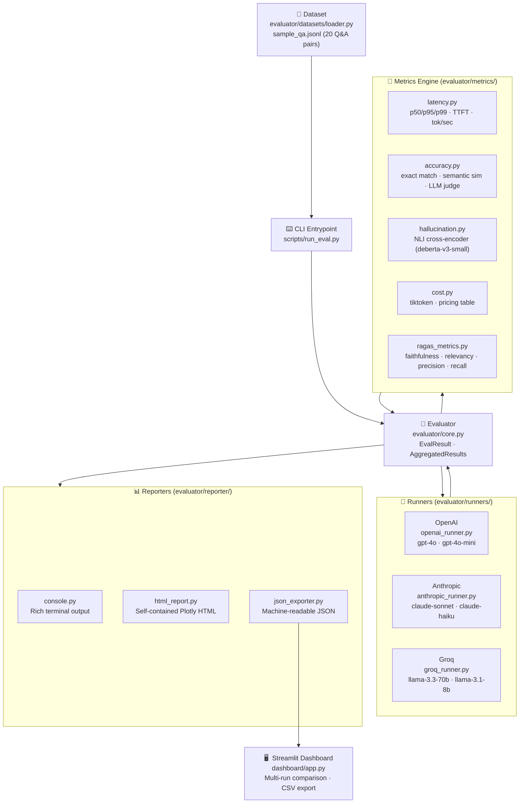

# LLM Evaluation Harness

A production-grade framework for benchmarking large language models across latency, accuracy, hallucination, and cost. Supports OpenAI, Anthropic, and Groq out of the box. Built as an AI engineer portfolio project with a fully automated evaluation pipeline, Rich terminal output, self-contained HTML reports, and a Streamlit comparison dashboard.

---

## Architecture



---

## Real Benchmark Results

Evaluated on 10 AI/ML Q&A pairs from `evaluator/datasets/sample_qa.jsonl`. All metrics enabled.

| Metric | llama-3.3-70b-versatile | llama-3.1-8b-instant |
|---|---|---|
| **P50 Latency** | 1,956 ms | 6,238 ms |
| **P95 Latency** | 2,427 ms | 7,122 ms |
| **TTFT (mean)** | **245 ms** | 4,074 ms |
| **Tokens/sec** | **257** | 200 |
| **Semantic Sim.** (LLM-scored) | **0.880** | 0.852 |
| **LLM Judge (/5)** | **4.00** | 4.00 |
| **Hallucination Rate** (NLI) | **0.0%** | **0.0%** |
| **RAGAS Faithfulness** | 0.808 | **0.825** |
| **RAGAS Context Precision** | **1.000** | **1.000** |
| **RAGAS Context Recall** | — | 0.933 |
| **Cost/query** | $0.000394 | **$0.0000395** |

> **Takeaways:**  
> - 70b dominates on speed (TTFT 245 ms vs 4 s) — Groq's LPU shines at inference.  
> - 8b is **10× cheaper** with comparable quality (judge 4.00/5, faithfulness 0.825 > 70b's 0.808).  
> - Both score 0.0% hallucination on structured AI/ML Q&A — high-quality context helps.  
> - RAGAS faithfulness > 0.75 for both models: strong grounding in provided context.

### Methodology Notes

| Metric | Implementation | Note |
|---|---|---|
| Semantic similarity | Groq `llama-3.1-8b-instant` scores similarity 0–1 | LLM-semantic scoring; captures paraphrase/synonyms better than TF-IDF |
| LLM Judge | Groq `llama-3.1-8b-instant`, 1–5 scale | OpenAI key not required; Groq used as fallback judge |
| NLI Hallucination | Groq `llama-3.1-8b-instant` zero-shot NLI | Local `cross-encoder/nli-deberta-v3-small` blocked by macOS MPS mutex — see below |
| RAGAS | Groq `llama-3.1-8b-instant` via OpenAI-compat API | LLM-only metrics (faithfulness, precision, recall); `answer_relevancy` requires embedding API |

### macOS MPS Threading Fix

Loading local HuggingFace models (sentence-transformers, cross-encoders) inside an asyncio context on macOS deadlocks at `import torch` due to Metal Performance Shaders (MPS) mutex contention. Two fixes were evaluated:

1. **`ProcessPoolExecutor(spawn)` — partially effective.** Spawning a fresh process avoids inherited Python-level locks, but macOS system-level Metal framework mutexes persist across processes.
2. **API-based inference — fully effective.** All quality metrics now use async Groq API calls: no local GPU/MPS, no model downloads, no deadlocks.

This is also production-realistic: shipping a service that offloads inference to a managed API avoids hardware dependency, cold-start latency, and OOM errors at scale.

---

## Quick Start

```bash
git clone https://github.com/your-handle/llm-eval-harness
cd llm-eval-harness
pip install -e .
cp .env.example .env      # then add your GROQ_API_KEY (and optionally OPENAI_API_KEY)

# Run a quick eval (5 items, Groq, no heavy metrics)
python3 scripts/run_eval.py \
  --model llama-3.3-70b-versatile \
  --max-items 5 \
  --report console \
  --no-ragas --no-nli --no-judge

# Full eval with HTML report
python3 scripts/run_eval.py \
  --model llama-3.3-70b-versatile \
  --max-items 10 \
  --output results/my_run.json \
  --report html

# Run all tests (offline, no API keys needed)
pytest tests/ -v
```

---

## Streamlit Dashboard

```bash
streamlit run dashboard/app.py
```

- Upload any `results/*.json` files exported by `run_eval.py`
- Side-by-side KPI cards, latency bars, accuracy/hallucination/cost charts, RAGAS radar
- Filterable per-question table with CSV export

For HuggingFace Spaces deployment with pre-loaded results, see [`spaces_app.py`](spaces_app.py).

---

## How to Add a New Model Runner

**Step 1.** Create `evaluator/runners/myprovider_runner.py`:

```python
from . import BaseRunner, RunResult
import time, os

class MyProviderRunner(BaseRunner):
    def __init__(self, model="my-model-v1", api_key=None, max_tokens=512):
        super().__init__(model=model, api_key=api_key or os.getenv("MYPROVIDER_API_KEY"), max_tokens=max_tokens)
        self._client = None

    def _get_client(self):
        if self._client is None:
            import myprovider_sdk
            self._client = myprovider_sdk.AsyncClient(api_key=self.api_key)
        return self._client

    async def run(self, prompt: str, system_prompt=None) -> RunResult:
        start = time.perf_counter()
        ttft_ms = None
        chunks = []

        async for chunk in self._get_client().stream(prompt):
            if ttft_ms is None and chunk.text:
                ttft_ms = self._elapsed_ms(start)
            chunks.append(chunk.text)

        return RunResult(
            response="".join(chunks),
            latency_ms=self._elapsed_ms(start),
            ttft_ms=ttft_ms,
            prompt_tokens=...,        # from SDK usage object
            completion_tokens=...,
            model=self.model,
        )
```

**Step 2.** Register in `evaluator/runners/__init__.py`:
```python
from .myprovider_runner import MyProviderRunner
__all__ = [..., "MyProviderRunner"]
```

**Step 3.** Wire in `scripts/run_eval.py` `resolve_runner()` and add pricing to `evaluator/metrics/cost.py` `PRICING_TABLE`.

---

## How to Add a New Metric

**Step 1.** Add the function to the appropriate `evaluator/metrics/*.py`:

```python
# evaluator/metrics/accuracy.py
def compute_rouge_l(prediction: str, reference: str) -> float:
    from rouge_score import rouge_scorer
    scorer = rouge_scorer.RougeScorer(["rougeL"], use_stemmer=True)
    return scorer.score(reference, prediction)["rougeL"].fmeasure
```

**Step 2.** Add the field to `EvalResult` in `evaluator/core.py` and call it in `Evaluator._run_single()`:
```python
# In EvalResult:
rouge_l: Optional[float] = None

# In _run_single():
result.rouge_l = compute_rouge_l(run.response, item.ground_truth)
```

**Step 3.** Add to `AggregatedResults.from_results()`, display in `ConsoleReporter.print_summary()`, and write a test in `tests/test_metrics.py`.

---

## Dataset Format

JSONL, one object per line:

```json
{
  "id": "qa_001",
  "question": "What is the attention mechanism in transformers?",
  "ground_truth": "Attention computes weighted sums of values...",
  "context": "The transformer architecture uses scaled dot-product attention...",
  "metadata": {"topic": "transformer", "difficulty": "medium"}
}
```

`context` is used by RAGAS and NLI hallucination checks. All other fields are required.

---

## CLI Reference

```
python3 scripts/run_eval.py \
  --model MODEL              # any Groq/OpenAI/Anthropic model ID
  --dataset PATH             # JSONL dataset (default: sample_qa.jsonl)
  --runs N                   # repeat each item N times for latency averaging
  --max-items N              # limit to first N items
  --output PATH              # JSON output path
  --report {console,html,both,none}
  --concurrency N            # max parallel API requests (default: 5)
  --system-prompt TEXT
  --no-ragas                 # skip RAGAS (needs OpenAI key)
  --no-nli                   # skip NLI hallucination check
  --no-judge                 # skip LLM-as-judge (saves cost)
  --no-semantic              # skip sentence-transformer similarity
```

---

## Project Structure

```
llm-eval-harness/
├── evaluator/
│   ├── core.py                  # EvalResult, AggregatedResults, Evaluator
│   ├── metrics/
│   │   ├── latency.py           # p50/p95/p99, TTFT, tokens/sec
│   │   ├── accuracy.py          # exact match, semantic sim, LLM judge
│   │   ├── hallucination.py     # NLI cross-encoder (deberta-v3-small)
│   │   ├── cost.py              # token counting + pricing table
│   │   └── ragas_metrics.py     # faithfulness, relevancy, precision, recall
│   ├── runners/
│   │   ├── openai_runner.py     # gpt-4o, gpt-4o-mini, o1
│   │   ├── anthropic_runner.py  # claude-haiku, claude-sonnet, claude-opus
│   │   └── groq_runner.py       # llama-3.3-70b, llama-3.1-8b (fast inference)
│   ├── datasets/
│   │   ├── loader.py            # Pydantic v2 JSONL loader
│   │   └── sample_qa.jsonl      # 20 AI/ML Q&A pairs with context
│   └── reporter/
│       ├── console.py           # Rich terminal output
│       ├── html_report.py       # Self-contained HTML + Plotly charts
│       └── json_exporter.py     # Machine-readable results JSON
├── dashboard/app.py             # Streamlit multi-run comparison
├── spaces_app.py                # HuggingFace Spaces version (pre-loaded results)
├── spaces_requirements.txt      # HF Spaces dependencies
├── scripts/run_eval.py          # CLI entrypoint
├── results/
│   ├── groq_70b.json            # llama-3.3-70b-versatile benchmark
│   └── groq_8b.json             # llama-3.1-8b-instant benchmark
└── tests/
    ├── test_metrics.py          # 53 tests (latency, accuracy, cost, NLI, RAGAS)
    ├── test_runners.py          # 21 tests (mocked async API calls)
    └── test_reporter.py         # 21 tests (console, HTML, JSON)
```

---

## Environment Variables

| Variable | Required for |
|---|---|
| `GROQ_API_KEY` | Groq models (llama, mixtral, gemma) |
| `OPENAI_API_KEY` | OpenAI models + LLM judge + RAGAS |
| `ANTHROPIC_API_KEY` | Anthropic/Claude models |

Copy `.env.example` → `.env` and fill in your keys.

---

## License

MIT
